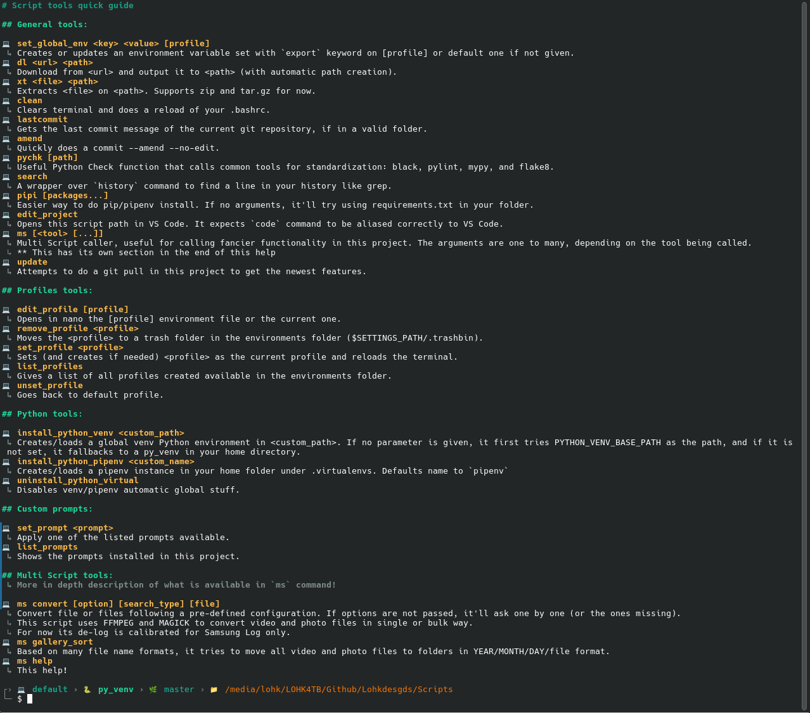
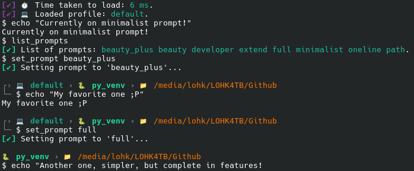

# Lohk's Scripts!

The easiest and most plug and play script to enhance your experience in your terminal!

## Does it work on X?

This was developed in a Debian-based OS called PikaOS. Most Linux distros should be good to go to run, if they come with bash.
For Windows users, Git Bash or MSYS2 *should* work. Personally, I don't use Windows myself, so if something breaks, please consider contributing with a pull request!

## How to install

1. Download via `git clone` (preferred) somewhere you know. Copy the path to it.
2. Add to your `.bashrc` the command: `source PATH/TO/SCRIPT/newcustom.sh;`
3. You're done!

## Examples!

#### The `ms help` command with all the features available from this script tool:

<figure>

<figcaption>Note: The commands may be slightly different depending on how the project goes. Consider running yourself the command to see the updated version!</figcaption>
</figure>

#### Some prompt layouts you can use just by `set_prompt`!

<figure>

<figcaption>Note: You can create your own under the parts folder in the script's folder. Copy one like full.sh and name it as you like. Maybe consider doing a pull request to share your invention with everyone!</figcaption>
</figure>